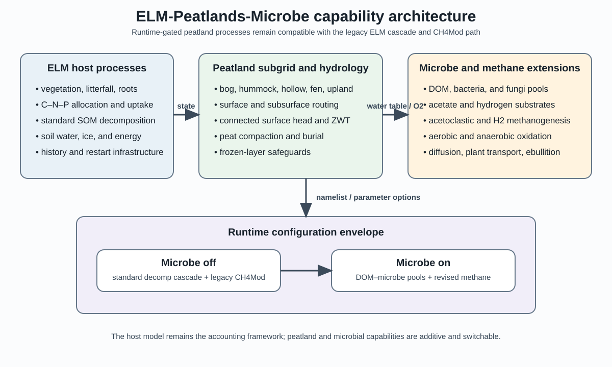
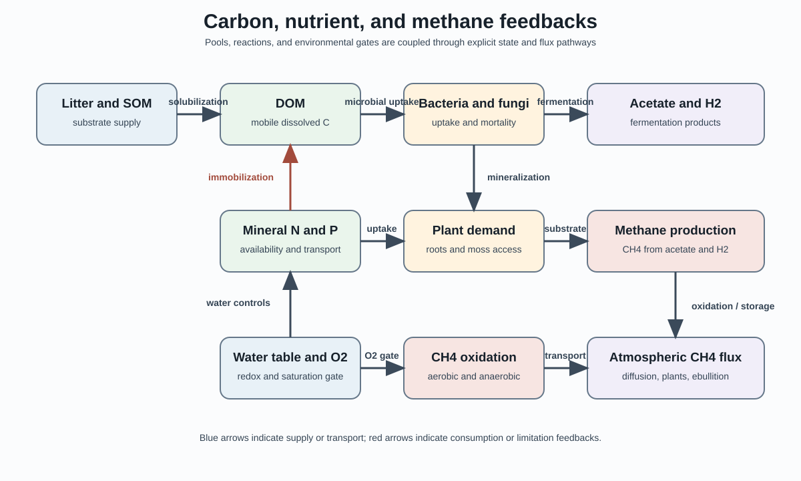
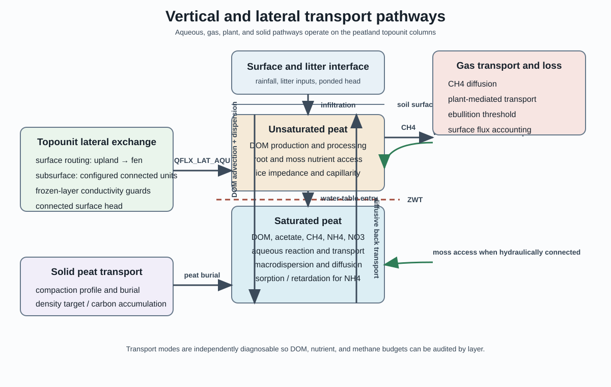

# ELM Peatlands Microbe Model Capabilities and Design

## Purpose

ELM-Peatlands-Microbe extends ELM for peatland applications while preserving the standard ELM decomposition, vegetation, hydrology, history, and restart infrastructure. The design adds explicit dissolved organic matter (DOM), bacterial, fungal, acetate, and revised methane processes behind runtime options. When the microbial options are disabled, the model retains the legacy B4B/decomposition and CH4Mod behavior.

The design is intended for site-level OLMT simulations, including US-MOz and SPRUCE, and for later regional applications. It separates the scientific capabilities that are peatland-specific from the general ELM host model so that non-peatland configurations can remain bit-for-bit compatible where required.

## Capability architecture

The host ELM processes provide vegetation, litterfall, root uptake, C-N-P allocation, standard SOM decomposition, soil water and ice, and the history/restart framework. Peatland infrastructure provides topounits, routing, column hydrology, peat compaction, burial, and frozen-layer safeguards. The microbial extension adds DOM, bacteria, fungi, fermentation substrates, methanogenesis, methane oxidation, and methane transport.

The runtime envelope supports two scientifically distinct modes:

- **Microbe off:** standard ELM decomposition and the legacy CH4Mod capability.
- **Microbe on:** DOM and microbial biomass pools coupled to the revised methane reaction and transport network.

The legacy methane capability is retained rather than overwritten. This is important for attribution tests, BFB checks, and comparison with existing ELM and CLM-SPRUCE experiments.

## Peatland subgrid and hydrology

Peatland cells can use topounits such as bog, hummock, hollow, fen, and upland. The topounit infrastructure supports configurable surface and subsurface connectivity, including special routing rules for three- and four-unit SPRUCE configurations. Surface water can contribute hydraulic head only when it is connected to the water table. Frozen-layer guards limit lateral exchange and prevent roots from drawing transpiration demand from layers below the active water table.

Column hydrology exposes water-table depth, surface water, soil liquid water, soil ice, recharge, lateral exchange, and layer-resolved lateral fluxes. Peatland-only options include adaptive root access, moss capillary nutrient access, peat compaction profiles, connected surface-head behavior, fen reconciliation, and post-solve conservation diagnostics. The soil-ice impedance exponent is a parameter so that winter water-table sensitivity can be evaluated without changing non-peatland behavior.

## DOM, bacteria, and fungi

DOM is introduced as a layer-resolved dissolved carbon pool coupled to the standard decomposition cascade. Litter and SOM decomposition produce DOM; bacteria and fungi consume DOM, return nutrients through mortality and mineralization, and feed back on substrate availability and C-N-P limitation. DOM can be transported vertically with aqueous advection, diffusion, and saturation-dependent macrodispersion. A relaxation mode remains available for comparison with the original CLM-SPRUCE implementation and published profiles.

The transport design distinguishes:

- production from litter and SOM;
- microbial uptake and mortality return;
- aqueous transport convergence and drainage loss;
- acetate production and consumption; and
- methane production, oxidation, and surface export.

These pathways are history-visible so that an apparently large DOM concentration or methane flux can be traced to its source and loss terms.

## Nutrient coupling

The microbial pools participate in the ecosystem nitrogen and phosphorus budget. Mineralization supplies mineral N and P, microbial immobilization competes with plant uptake, and microbial mortality returns organic nutrients. Vascular plants use their root distributions; moss can use a separate hydraulically connected capillary-access pathway. Conservative aqueous transport is available for mineral nutrients, with ammonium sorption and retardation rather than transporting the entire ammonium pool as a freely mobile tracer.

The model records gross mineralization, immobilization, plant uptake, deposition to the plant N pool, fixation, nitrification, and denitrification. Oxygen and pH handling are intended to remain consistent between the nutrient and methane reaction pathways, but the parameter values and unit conventions require scientific validation.

## Revised methane capability

The revised methane module resolves acetoclastic and hydrogenotrophic production, aerobic and anaerobic oxidation, porewater methane storage, and surface export by diffusion, plant-mediated transport, and ebullition. Production and oxidation are explicit carbon-budget terms in the microbial methane path. This differs from the legacy CH4Mod accounting, where the treatment of FCH4 and heterotrophic respiration is not identical.

The methane reaction kernel is controlled by substrate, biomass, temperature, pH, redox, oxygen, and saturation. Acetate and methane concentrations can be diagnosed separately in unsaturated and saturated subareas and compared with SPRUCE porewater observations.

## Vertical, lateral, and gas transport

The transport implementation keeps solid peat burial separate from aqueous and gas transport. DOM and nutrients move through layer interfaces; topounit lateral exchange operates through configured hydraulic connections; and methane leaves the column through the three surface pathways. Layer-resolved diagnostics make it possible to distinguish net downward transport from compensating upward diffusion and local processing.

The principal transport sensitivities are aqueous dispersion, saturated macrodispersion, the mobile fraction, mechanical dispersivity, preferential-flow/leaching fractions, and the depth scalar used by selected reactions. These choices should be calibrated against DOM, acetate, methane, water-table, and productivity observations jointly rather than against methane flux alone.

## Configuration and parameter policy

Runtime switches select peatland roots, moss capillary nutrients, peatland vertical transport, peat compaction, microbial methane, aqueous transport, preferential flow, methane macrodispersion, relaxation reference mode, observed-DOM calibration, HUMHOL saturation behavior, and nonbog gas transport. Scientific parameters are being migrated into the standard ELM parameter file rather than maintained as hidden source constants. This includes the microbial C-N-P stoichiometry, methane reaction constants, transport coefficients, peat compaction parameters, frozen-soil impedance, and moss capillary-access limits.

The standard SPRUCE workflow uses OLMT with CIME/cpl_bypass, MCT as the default driver on Docker and Pathfinder, and a reduced portable input-data tree for site simulations. The Docker workflow mounts the host working directory as `/code`, input data as `/inputdata`, and persistent case/build/output data as `/output`. The host directory name is not part of the model assumption; the required sibling layout is `E3SM-Peatlands-Microbe`, `elm-olmt`, and `inputdata`.

## Validation sequence

The recommended validation order is:

1. non-peatland BFB and legacy CH4Mod checks;
2. DOM, bacteria, and fungi pool balance checks;
3. one-layer reaction-kernel parity tests;
4. transport sensitivities using mature restarts;
5. joint DOM, acetate, methane, nutrient, water-table, and productivity comparisons;
6. 50- to 100-year accelerated and final spinup tests; and
7. transient and warming-treatment simulations.

Scientific validation still needs to constrain the microbial growth and mortality rates, C-N-P ratios, acetate and methane half-saturation constants, oxygen and pH scalars, dispersion and mobile-fraction assumptions, ebullition threshold, plant transport, moss nutrient access, denitrification, and peat density/compaction behavior. Observed porewater profiles and carbon-age information should be used to determine whether DOM is being produced in the right pools and delivered to the saturated zone through a defensible pathway.

## Figure files

The figures are stored as standalone SVG files in `docs/design_figures/` so they can be uploaded with this Markdown file or converted to PNG for Google Docs.
